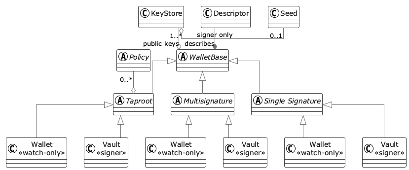
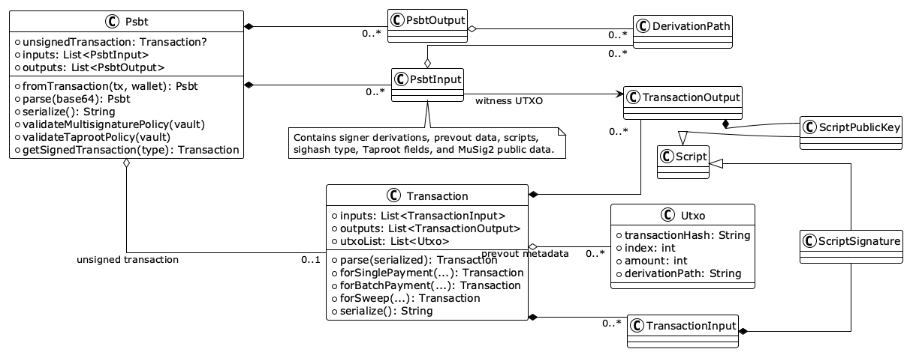

# Coconut_lib

The Coconut_lib is a development tool for mobile air gap Bitcoin wallets. It is written in [`Dart`](https://dart.dev/).
Coconut Vault and Coconut Wallet were created using this library.
Download from Appstore and Play Store.

- [Coconut Vault (for iOS)](https://apps.apple.com/us/app/6651839033)
- [Coconut Wallet (for iOS)](https://apps.apple.com/us/app/6654902298)
- [Coconut Vault (for Android)](https://play.google.com/store/apps/details?id=onl.coconut.vault.regtest)
- [Coconut Wallet (for Android)](https://play.google.com/store/apps/details?id=onl.coconut.wallet.regtest)

And visit tutorial page for Self-custody we provided. (www.coconut.onl)

> ⚠ The Coconut_lib is still a project under development.
> Therefore, we are not responsible for any problems that may arise while using it.
> Please review it carefully and use it.

## About

The Coconut_lib provides the base code for developing Bitcoin vaults and wallets based on Bitcoin airgap.
Since coconut_lib is developed in [`Dart`](https://dart.dev/), it is specialized for developing applications for iPhone and Android by utilizing the [`Flutter`](https://flutter.dev/).
In particular, The Coconut_lib designed to develop air-gap-based vault and wallet apps separately by clearly distinguishing the vault area and wallet area.
You can use the Coconut_lib to create your own air-gap based vault and wallet.

"Don't trust, verify and develop!"

## Fully Open Source

Coconut_lib is fully open source. The entire source code is publicly available
for anyone to inspect, verify, use, modify, and redistribute under the
[MIT License](https://github.com/noncelab/coconut_lib/blob/main/LICENSE). There are no closed-source or proprietary parts of this
library.

## Architecture

- [wallet](https://github.com/noncelab/coconut_lib/blob/main/lib/src/wallet): Provides a cryptography-based key management method. Create two apps instancing the Wallet and Vault classes.
[](https://github.com/noncelab/coconut_lib/blob/main/doc/design/README.md)
- [transaction](https://github.com/noncelab/coconut_lib/blob/main/lib/src/transaction): Provides code related to Bitcoin scripts and transactions. Also use PSBT(BIP-0174) to communicate vaults and wallets.
[](https://github.com/noncelab/coconut_lib/blob/main/doc/design/README.md)

> For more development information, visit the [coconut_lib docs](https://pub.dev/documentation/coconut_lib/latest/coconut_lib/coconut_lib-library.html).

## Example

This example uses Regtest and a public test mnemonic. Never use this mnemonic
or the sample transaction ID with real funds.

```dart
import 'dart:convert';

import 'package:coconut_lib/coconut_lib.dart';

void main() {
  // 1. Choose a Bitcoin network.
  NetworkType.setNetworkType(NetworkType.regtest);

  // 2. Create a vault. It owns the seed and signs transactions.
  final vault = SingleSignatureVault.fromMnemonic(
    utf8.encode(
      'abandon abandon abandon abandon abandon abandon abandon abandon abandon abandon abandon about',
    ),
    addressType: AddressType.p2wpkh,
  );

  // 3. Create a watch-only wallet from the vault's public descriptor.
  final wallet = SingleSignatureWallet.fromDescriptor(vault.descriptor);
  print('Receive address: ${wallet.getAddress(0)}');

  // 4. Describe a spendable UTXO belonging to receive address index 0.
  // Replace these sample values with data from your Bitcoin node or indexer.
  final utxo = Utxo(
    // Transaction ID
    '0000000000000000000000000000000000000000000000000000000000000000',
    0, // Output index
    100000, // Value in satoshis
    "${wallet.derivationPath}/0/0", // Address derivation path
  );

  // This demo sends to another address in the same wallet.
  // Replace it with the actual recipient address in your application.
  final recipientAddress = wallet.getAddress(1);
  final transaction = Transaction.forSinglePayment(
    [utxo],
    recipientAddress,
    "${wallet.derivationPath}/1/0",
    50000, // Amount in satoshis
    2, // Fee rate in sat/vB
    wallet,
  );

  // 5. Build a PSBT in the wallet, sign it in the vault, and finalize it.
  final unsignedPsbt = Psbt.fromTransaction(transaction, wallet);
  final signedPsbt = vault.addSignatureToPsbt(unsignedPsbt.serialize());
  final signedTransaction =
      Psbt.parse(signedPsbt).getSignedTransaction(wallet.addressType);

  print('Signed transaction: ${signedTransaction.serialize()}');
}
```

## Tests

### Generate Mock Classes

```sh
dart pub run build_runner build
```

### Unit Test

```sh
dart test -t unit
```

### E2E Test

```sh
dart test -t e2e
```

### Coverage

The following tools are required to generate test coverage (for MacOS):

```sh
dart pub global activate coverage

brew install lcov
```

To generate test coverage, run the following command:

```sh
sh ./generate_unit_coverage.sh
```

## BIP Support

Support is scoped to the wallet, address, transaction, PSBT, and descriptor
features implemented by this library. Legacy P2PKH, legacy P2SH multisig, and
bare multisig wallets are not supported. Nested SegWit (P2WPKH-in-P2SH) is
also not supported.

### Keys and Wallet Structure

- [BIP-32](https://github.com/bitcoin/bips/blob/master/bip-0032.mediawiki): Hierarchical Deterministic Wallets
- [BIP-39](https://github.com/bitcoin/bips/blob/master/bip-0039.mediawiki): Mnemonic code for generating deterministic keys
- [BIP-48](https://github.com/bitcoin/bips/blob/master/bip-0048.mediawiki): Multi-Script Hierarchy for Multi-Signature Wallets
- [BIP-84](https://github.com/bitcoin/bips/blob/master/bip-0084.mediawiki): Derivation Scheme for Native SegWit P2WPKH Accounts
- [BIP-86](https://github.com/bitcoin/bips/blob/master/bip-0086.mediawiki): Key Derivation for Single-Key P2TR Outputs

### Scripts and Addresses

- [BIP-67](https://github.com/bitcoin/bips/blob/master/bip-0067.mediawiki): Deterministic Multisig Key Sorting
- [BIP-141](https://github.com/bitcoin/bips/blob/master/bip-0141.mediawiki): Segregated Witness
- [BIP-143](https://github.com/bitcoin/bips/blob/master/bip-0143.mediawiki): Transaction Signature Verification for Version 0 Witness Programs
- [BIP-173](https://github.com/bitcoin/bips/blob/master/bip-0173.mediawiki): Bech32 Addresses for Native SegWit Version 0 Outputs
- [BIP-350](https://github.com/bitcoin/bips/blob/master/bip-0350.mediawiki): Bech32m Addresses for SegWit Version 1+ Outputs

### Taproot and Signatures

- [BIP-327](https://github.com/bitcoin/bips/blob/master/bip-0327.mediawiki): MuSig2 for BIP340-Compatible Multi-Signatures
- [BIP-340](https://github.com/bitcoin/bips/blob/master/bip-0340.mediawiki): Schnorr Signatures for secp256k1
- [BIP-341](https://github.com/bitcoin/bips/blob/master/bip-0341.mediawiki): Taproot Spending Rules
- [BIP-342](https://github.com/bitcoin/bips/blob/master/bip-0342.mediawiki): Tapscript

### Wallet Interchange and PSBT

- [BIP-129](https://github.com/bitcoin/bips/blob/master/bip-0129.mediawiki): Bitcoin Secure Multisig Setup (BSMS)
- [BIP-174](https://github.com/bitcoin/bips/blob/master/bip-0174.mediawiki): Partially Signed Bitcoin Transaction Format
- [BIP-370](https://github.com/bitcoin/bips/blob/master/bip-0370.mediawiki): PSBT Version 2
- [BIP-371](https://github.com/bitcoin/bips/blob/master/bip-0371.mediawiki): Taproot Fields for PSBT
- [BIP-373](https://github.com/bitcoin/bips/blob/master/bip-0373.mediawiki): MuSig2 PSBT Fields

### Output Script Descriptors

- [BIP-380](https://github.com/bitcoin/bips/blob/master/bip-0380.mediawiki): Output Script Descriptors General Operation
- [BIP-382](https://github.com/bitcoin/bips/blob/master/bip-0382.mediawiki): SegWit Output Script Descriptors
- [BIP-383](https://github.com/bitcoin/bips/blob/master/bip-0383.mediawiki): Multisig Output Script Descriptors
- [BIP-386](https://github.com/bitcoin/bips/blob/master/bip-0386.mediawiki): Taproot Output Script Descriptors
- [BIP-389](https://github.com/bitcoin/bips/blob/master/bip-0389.mediawiki): Multipath Descriptor Key Expressions

## Contribution

Reference [CONTRIBUTING](https://github.com/noncelab/coconut_lib/blob/main/.github/CONTRIBUTING.md)

## Bug report and Contact us

- Github Issue, PR
- [hello@noncelab.com](mailto:hello@noncelab.com)
- coconut.onl

## License

Coconut_lib is fully open source and distributed under the
[MIT License](https://github.com/noncelab/coconut_lib/blob/main/LICENSE).
